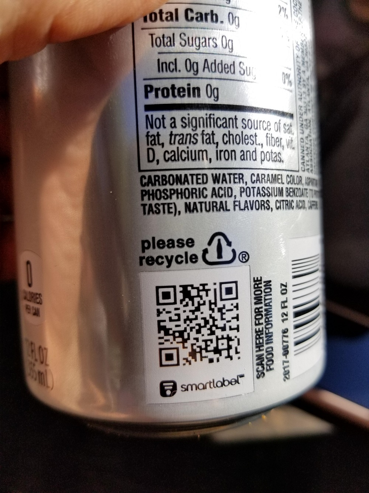

龙芯3A5000 二进制翻译与二维码扫描测试

本仓库主要记录了[Dynamsoft Barcode Reader（DBR）](https://www.dynamsoft.com/barcode-reader/overview/)在龙芯3A5000上的运行测试。

龙芯3A5000国产CPU采用自主研发的Loongson架构，支持以软硬结合的方式翻译arm、mips和x86架构的应用。Dynamsoft Barcode Reader是用C++编写的条码扫描SDK，并支持用Javascript、Java、Objective-C、Python等语言进行调用。

目前DBR还没有Loongson架构的库，这里主要以二进制翻译的形式运行x86的程序，记录解下面两张图分别用的时间。




测试结果（时间单位为秒）：

|                 | 图1    | 图2    |
|-----------------|--------|--------|
| Wine 32bit      | 0\.086 | 1\.207 |
| WebAssembly     | 0\.254 | 0\.397 |


在Intel i5 10400的Windows设备上的解码时间分别为: 0.016, 0.187。可以看到运行速度存在一定差距。


下面具体的测试过程：

## Linux x86

x86端编译[这个仓库](https://github.com/yushulx/cmake)的Linux二进制文件，并在龙芯上运行，但显示错误：

```
lophyxp@sancog:/tmp/dbr$ ./BarcodeReader
latx-x86_64: ./BarcodeReader: requires virtual address space that is in use (omit the -B option or choose a different value)
```

可以看到系统会用翻译器来运行，但不清楚这里错误的原因，暂时不测试了。

## Windows x86

Windows上编译[这个项目](https://www.dynamsoft.com/barcode-reader/resources/code-gallery/?SampleID=82)的32位二进制文件，并在龙芯上使用wine运行。这里因为没搞定wine的64位环境，测的32位版。

1. 安装wine

    ```
    $ sudo apt install wine
    ```

2. 可以发现wine的二进制文件是x86的

    ```
    lophyxp@sancog:~$ file /opt/wine-6.0/bin/wine
    /opt/wine-6.0/bin/wine: ELF 32-bit LSB executable, Intel 80386, version 1 (SYSV), dynamically linked, interpreter /lib/ld-linux.so.2, for GNU/Linux 3.2.0, BuildID[sha1]=18bb34b3edf8be645836f13cdd815c1fd3ef94b0, with debug_info, not stripped
    ```

3. 直接运行DBR

    ```
    lophyxp@sancog:/tmp/dbr_x86$ wine ./BarcodeReaderDemo.exe
    *************************************************
    Welcome to Dynamsoft Barcode Reader Demo
    *************************************************
    Hints: Please input 'Q'or 'q' to quit the application.
    >> Step 1: Input your image file's full path:
    ```

## Java

DBR的Java版用JNI调用的C++库，在龙芯上运行会提示无法加载提供的Linux AMD64的库。看来只有直接运行可执行程序时才会进行二进制翻译。

```
$ java -jar BarcodeReader.jar
java.lang.UnsatisfiedLinkError: /tmp/dynamsoft/8.8/libDynamsoftBarcodeJNI.so: /tmp/dynamsoft/8.8/libDynamsoftBarcodeJNI.so: 无法打开共享对象文 件: 没有那个文件或目录 (Possible cause: can't load AMD 64-bit .so on a LOONGARCH64-bit platform)
```

## WebAssembly

DBR的JS版采用WebAssembly编译，可以直接用node运行。


